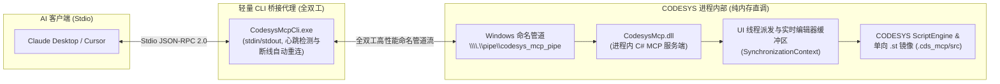

# CODESYS 原生 C# Stdio MCP 插件 (`codesys-mcp-plugin`)

[English](README.md) | **中文**

---

本项目通过 **C# / .NET 原生进程内程序集 (`CodesysMcp.dll`)** 与轻量级 **Stdio 命令行桥接器 (`CodesysMcpCli.exe`)**，为 **CODESYS V3.5** 提供高性能的模型上下文协议（**MCP - Model Context Protocol**）服务。

支持各类 AI 辅助编程客户端（如 **Claude Desktop**、**Cursor**、**Windsurf**、**Antigravity** 等）直接检查、编辑、编译和管理 CODESYS PLC 工程，具备 **零网络端口**、**零防火墙配置** 以及 **零磁盘文件轮询** 的特点。

---

## 🚀 核心架构与技术优势


```mermaid
flowchart LR
    subgraph Client["AI 客户端 (Stdio)"]
        AI["Claude Desktop / Cursor"]
    end

    subgraph Bridge["轻量 CLI 桥接代理 (全双工)"]
        CLI["CodesysMcpCli.exe\n(stdin/stdout, 心跳检测与\n断线自动重连)"]
    end

    subgraph CODESYS["CODESYS 进程内部 (纯内存直调)"]
        Pipe["Windows 命名管道\n\\\\.\\pipe\\codesys_mcp_pipe"]
        Core["CodesysMcp.dll\n(进程内 C# MCP 服务端)"]
        UI["UI 线程派发与实时编辑器缓冲区\n(SynchronizationContext)"]
        Engine["CODESYS ScriptEngine &\n单向 .st 镜像 (.cds_mcp/src)"]
        
        Pipe --> Core
        Core --> UI
        UI --> Engine
    end

    AI <-->|Stdio JSON-RPC 2.0| CLI
    CLI <-->|全双工高性能命名管道流| Pipe
```

1. **纯 Stdio 与高可用全双工命名管道（零网络端口）**：
   - 通过 `CodesysMcpCli.exe` 将标准输入输出 (`stdin`/`stdout`) 与本地 Windows 命名管道 (`\\.\pipe\codesys_mcp_pipe`) 全双工直连；支持 `PendingRequestIds` 在途响应排空（防止单次 CLI 调用在 `stdin` EOF 时提前退出）、15 秒空闲心跳探活及 `CODESYS.exe` 重启自动重连。
   - 无需开放任何 HTTP/TCP 端口，不触发防火墙警报，杜绝端口冲突与网络暴露风险。
2. **真正的进程内性能与 IDE 实时未保存缓冲区感知**：
   - 直接在 CODESYS 进程内存中读取 ScriptEngine 对象及当前打开的 ST/宣言区编辑器内存缓冲区（`SynEdControl.Buffer` 与 `SwitchableDeclarationEditor.DeclarationEditor`）。
   - `read_pou`、`search_code`、`get_diff`、`preview_diff` 及 `.st` 镜像同步均可即时读取 IDE 中尚未保存的实时输入，无需手动按 `Ctrl+S` 或切换窗口焦点。
3. **实时单向 `.st` 源码镜像与保存自动 Git 提交（`CODESYS -> .cds_mcp/src`）**：
   - 自动将工程中的 POU、GVL、DUT、Method、Property、Action 镜像导出至 `<project_dir>\.cds_mcp\src`（附带 IEC 注释头与 SHA-256 差异防抖），并在 `save_project` 或 IDE `Ctrl+S` 保存时自动在后台执行 `git commit`。
4. **CODESYS IDE (GUI) 线程安全支持**：
   - 通过捕获 `SynchronizationContext.Current`，将后台命名管道收到的指令安全派发至 CODESYS UI 主线程执行，绝不引发界面卡死或并发崩溃。
5. **无需 3S 商业数字签名**：
   - 针对 CODESYS 官方 `.package` 原生插件强制校验商业签名的限制，采用 CLR 运行时原生加载方案，开箱即用。

---

## 📁 目录结构

```text
codesys-mcp-plugin/
├── bin/Release/
│   ├── CodesysMcp.dll                   # 注入 CODESYS 进程内部的 C# 核心服务程序集
│   └── CodesysMcpCli.exe                # 全双工 Stdio 协议桥接器（含心跳探活与断线自动重连）
├── CodesysMcp/                          # C# 进程内插件源码（Partial Class 模块化结构）
│   ├── CodesysContext.cs                # CODESYS 上下文与 UI 主线程安全调度 (SynchronizationContext)
│   ├── CodesysOperations.cs             # 工程/对象树 API、会话快照与基线追踪
│   ├── CodesysOperations.Pou.cs         # POU 增删改、文件夹、接口、方法与属性管理
│   ├── CodesysOperations.Compiler.cs    # 工程编译控制与 IDE 多通道消息读取
│   ├── CodesysOperations.SearchAndDiff.cs # 融合实时缓冲区的全局搜索、Diff 生成、预览与回滚
│   ├── CodesysOperations.Mirror.cs      # 自适应 IDE -> .st 轮询镜像与保存自动 Git 提交钩子
│   ├── McpServer.cs                     # Windows 多实例命名管道全双工 JSON-RPC 2.0 服务端引擎
│   ├── McpServer.Schemas.cs             # 全部 48 项已注册 MCP 工具 Schema 定义与参数校验
│   ├── CodesysEditorBufferHelper.cs     # IDE 未保存 ST/宣言区编辑框内存缓冲区反射读取器
│   ├── SourceMirrorHelper.cs            # 单向 .st 序列化器、SHA-256 差异防抖与 Git 集成
│   ├── CodesysOnlineHelper.cs           # PLC 在线登录、运行控制与拓扑巡检
│   ├── CodesysOnlineHelper.Variables.cs # 变量读写、失效句柄自动驱逐与强制控制
│   ├── CodesysOnlineHelper.Batch.cs     # 原子批量写入、DUT 结构体与数组读写
│   ├── PlcTraceAndLoggerHelper.cs       # Trace 启停、信号触发配置与 CSV/XML 波形分析
│   ├── PlcTraceAndLoggerHelper.Logger.cs# PLC 环形黑匣子日志与在线 CmpLog 设备日志读取
│   ├── CodesysIdeUiHelper.cs            # IDE 状态栏指示灯、诊断卡片及主窗口截图工具
│   ├── DeviceLogonWatchdog.cs           # Win32 原生模态登录与确认弹窗看门狗守护
│   └── ServerBootstrap.cs               # 供 IronPython 调用的静态启动与热重载交接入口
├── CodesysMcpCli/
│   └── Program.cs                       # 全双工 stdin/stdout 管道转发与 EOF 在途响应排空引擎
├── CodesysMcpTests/                     # C# 核心单元测试与真实 DLL 契约测试集（150 项测试）
├── tests/
│   ├── test_cli_protocol.py             # 基于 Mock 命名管道的 CLI 协议、心跳与重连集成测试
│   ├── test_codesys_e2e.py              # CODESYS 实时工程闭环 E2E 测试集
│   └── test_live_ide_editor_sync.py     # Win32 后台按键注入 + 实时缓冲区 + 全量 E2E 联合测试
├── codesys_mcp_session.py               # CODESYS 启动挂载脚本（自动识别 GUI IDE 与 --noUI 模式）
├── start_codesys_ide_with_mcp.bat       # 一键启动 CODESYS IDE (带界面) 并自动挂载 MCP 插件
├── run_codesys_mcp.ps1                  # PowerShell 启动器（支持 GUI IDE 模式与 -NoUI 后台模式）
├── launch_mcp.py                        # 后台无头模式守护启动脚本（带命名管道就绪探测）
├── build.ps1                            # Roslyn 一键编译脚本
├── run_tests.ps1                        # 一键编译 + C# 单元测试 + Python 协议测试运行器
├── package_release.ps1                  # 一键 Release 发行包压缩脚本
└── test_cli_stdio.py                    # 纯 Stdio 链路快速冒烟演示脚本
```

---

## 🖥️ 如何安装与挂载到 CODESYS IDE 里面？

你可以通过 **3 种方式** 将其挂载运行在 CODESYS IDE 中：

### 方式一：一键启动带插件的 CODESYS IDE（推荐，最省心）
直接双击运行本目录下的 [`start_codesys_ide_with_mcp.bat`](start_codesys_ide_with_mcp.bat)，或修改你桌面上的 CODESYS 快捷方式“目标(Target)”为：
```cmd
"C:\Program Files\CODESYS 3.5.20.50\CODESYS\Common\CODESYS.exe" --profile="CODESYS V3.5 SP20 Patch 5" --runscript="C:\path\to\codesys-mcp-plugin\codesys_mcp_session.py"
```
- **运行效果**：CODESYS IDE 正常打开图形界面，启动时在后台加载 `CodesysMcp.dll` 并激活 `\\.\pipe\codesys_mcp_pipe` 管道，随后前台脚本自动退出。
- IDE 底部消息栏会输出：
  `[CODESYS MCP] Native Stdio/Pipe MCP Server started on \\.\pipe\codesys_mcp_pipe`
- 完全不阻塞你在 IDE 中的任何正常开发操作，AI 可随时读写代码。

### 方式二：在已打开的 CODESYS IDE 中手动加载
如果你已经打开了 CODESYS IDE 正在编写工程，无需重启 IDE：
1. 在 CODESYS 顶部菜单栏点击 **`Tools` (工具) -> `Scripting` (脚本) -> `Execute Script File...` (执行脚本文件...)**。
2. 选择 `C:\path\to\codesys-mcp-plugin\codesys_mcp_session.py`。
3. 后台命名管道立即激活，AI 客户端即可实时读写你当前在 IDE 中打开的工程。

### 方式三：固定到 CODESYS IDE 顶部工具栏 / 脚本目录（做成 IDE 按钮）
如果你想在 CODESYS IDE 界面里拥有一个专属启动按钮：
1. 打开 CODESYS IDE，点击菜单 **`Tools` (工具) -> `Customize...` (自定义...)**。
2. 切换到 **`Toolbars` (工具栏)** 或 **`Menu` (菜单)** 选项卡，启用 **`Scripting` (脚本)** 工具栏，或者添加 **`Execute Script File`** 命令按钮并指向 `codesys_mcp_session.py`。
3. 之后在 IDE 工具栏点一下图标即可启动 MCP 服务。

---

## 🔌 配置 AI 客户端（纯 Stdio 模式，无需任何 HTTP Server）

无论你使用的是 **Claude Desktop**、**Cursor**、**Windsurf** 还是其他 MCP 客户端，全部统一通过 **Stdio** 调用 `CodesysMcpCli.exe`，无需开启任何端口。

```json
{
  "mcpServers": {
    "codesys": {
      "command": "C:\\path\\to\\codesys-mcp-plugin\\bin\\Release\\CodesysMcpCli.exe",
      "args": [],
      "env": {
        "CODESYS_DEVICE_USER": "admin",
        "CODESYS_DEVICE_PASSWORD": "<PASSWORD>"
      }
    }
  }
}
```

---

## 🔐 设备在线鉴权与无人值守安全机制

CODESYS Control（如 SoftPLC `CODESYS Control Win V3 x64`）通常启用了设备用户权限管理。在未鉴权状态下连接时，底层会触发 Win32 模态登录弹窗（`#32770`），导致自动化测试与 AI 客户端在无界面或无人值守时挂起卡死。

本插件内置了 **三重防御安全机制**，彻底根除模态弹窗死锁，实现零干预、秒级静默登录：

### 1. 默认凭据与零干预秒级登录
* **默认账号与凭据**：默认管理员用户名为 **`admin`**，密码为 **`<PASSWORD>`**（通过环境变量 `CODESYS_DEVICE_PASSWORD` 或 `plc_login` 参数配置）。
* **源头握手鉴权**：在调用 `plc_login` 时，插件自动在通信底层执行 `online.set_default_credentials(user, pass)`，从源头抑制模态登录对话框弹出，连接耗时通常控制在 2 秒以内。

### 2. 自定义设备凭据的三种配置方式（按优先级排序）

1. **方式一：MCP 工具显式传参（最高优先级）**
   AI 客户端在调用 `plc_login` 时可直接传入指定的用户名和密码：
   ```json
   {
     "name": "plc_login",
     "arguments": {
       "application": "Application",
       "username": "your_user",
       "password": "<PASSWORD>"
     }
   }
   ```
2. **方式二：AI 客户端配置中注入环境变量（推荐，最省心）**
   在 `claude_desktop_config.json` 或各客户端的 MCP 设置中配置 `env`：
   * `CODESYS_DEVICE_USER`: 目标设备用户名
   * `CODESYS_DEVICE_PASSWORD`: 目标设备密码
3. **方式三：操作系统全局/用户环境变量**
   在 Windows 系统环境变量或启动脚本中配置 `CODESYS_DEVICE_USER` 与 `CODESYS_DEVICE_PASSWORD`。

### 3. 原生 Win32 看门狗守护（Watchdog）
* 插件内置后台 `DeviceLogonWatchdog`，在登录执行期间主动监测主 UI 线程的所有模态弹窗。
* 若遭遇未预期的设备登录对话框，看门狗会尝试自动填充凭据并确认；若匹配失败则在 1 秒内自动发送 `IDCANCEL` 取消弹窗并向客户端报告错误，**彻底杜绝 UI 线程死锁 30 秒超时**。

---

## ⚙️ 常用环境变量与高级配置

| 环境变量 | 默认值 | 说明 |
| :--- | :--- | :--- |
| `CODESYS_DEVICE_USER` | `admin` | SoftPLC / 目标设备默认登录用户名 |
| `CODESYS_DEVICE_PASSWORD` | `<PASSWORD>` | SoftPLC / 目标设备登录密码 |
| `CODESYS_MCP_LOG_FILE` | `~/.codesys-mcp-plugin/session_debug.log` | 插件运行时统一会话日志路径（自动 10MB 滚动防护） |
| `CODESYS_MCP_PIPE` | `codesys_mcp_pipe` | Windows 命名管道名称（默认 `\\.\pipe\codesys_mcp_pipe`） |
| `CODESYS_MCP_PROJECT` | 无 | 启动 CODESYS 时默认自动加载打开的 `.project` 绝对路径 |
| `CODESYS_MCP_MIRROR_DIR` | `<project_dir>\.cds_mcp\src` | 单向 `.st` 源码镜像导出目标目录（`CODESYS -> .st`） |

---

## 🛠️ 支持的 MCP 工具列表（共 48 项）

### 1. 工程管理与导航
| 工具名称 | 参数说明 | 功能描述 |
| :--- | :--- | :--- |
| `open_project` | `path: string` | 打开指定的 `.project` 工程文件 |
| `close_project` | 无 | 关闭当前打开的工程 |
| `save_project` | 无 | 保存当前打开的工程，并自动触发 `.st` 镜像 Git 提交 |
| `get_project_info` | 无 | 获取当前工程名称、路径、修改状态 (`isDirty`)、活动应用、宿主 CODESYS IDE 版本信息 (`ideVersion`、`ideProfile`、`uiMode`) 及 `.st` 镜像状态 |
| `get_project_tree` | `full?: bool` | 递归获取工程对象树（设备、应用、POU、GVL、任务结构） |
| `create_folder` | `name: string`, `parent?: string` | 创建工程组织目录文件夹 |
| `create_interface` | `name: string`, `folder?: string` | 创建 IEC 接口对象 (`ITF`) |
| `create_method` | `pou: string`, `name: string`, `return_type?: string` | 为指定的 POU / FB 创建方法 (`METHOD`) |
| `create_property` | `pou: string`, `name: string`, `type?: string` | 为指定的 POU / FB 创建属性 (`PROPERTY`) |
| `create_boot_application` | `application?: string` | 在控制器中生成 Boot 启动引导应用 |

### 2. 代码读写、搜索、镜像与快照回滚
| 工具名称 | 参数说明 | 功能描述 |
| :--- | :--- | :--- |
| `read_pou` | `name: string` | 读取指定 POU 的声明区 (`VAR...END_VAR`) 和实现区 (`ST` 代码)，自动融合 IDE 未保存实时编辑缓冲区 |
| `write_pou` | `name`, `declaration`, `implementation`, `type` | 创建新 POU 或更新已有 POU 的声明区和实现区代码 |
| `edit_pou` | `name`, `target`, `replacement`, `section?` / `edits?` | 局部精准搜索/替换修改 POU（无需重传全文），自动融合 IDE 实时未保存缓冲区并返回 Unified Diff |
| `delete_pou` | `name: string` | 从工程中安全删除指定的 POU 对象 |
| `search_code` | `query: string`, `is_regex?: bool`, `scope?: string` | 全局搜索普通文本或正则表达式（包含 IDE 未保存实时缓冲区），精准返回 1-based 行号及上下文 |
| `get_diff` | `name?: string`, `section?: string` | 生成当前会话中对 POU 改动的标准 Unified Diff 对比报告（包含 IDE 手工未保存修改） |
| `preview_diff` | `name: string`, `declaration?: string`, `implementation?: string` | 基于实时编辑器缓冲区与基线快照预估写入后的 Diff 差异，而不实际修改工程 |
| `rollback_pou` | `name: string` | 一键将 POU 安全回滚至会话基线快照（新增 POU 则安全删除） |
| `sync_sources_to_disk` | `mirror_dir?: string`, `persist_for_session?: bool`, `root_node?: string`, `watch?: bool`, `disable?: bool` | 将工程 POU、DUT、GVL 与方法增量镜像导出为 `.st` 文件（单向 `CODESYS -> .st`，保存时自动 Git 提交） |

### 3. 编译诊断与 IDE 消息感知
| 工具名称 | 参数说明 | 功能描述 |
| :--- | :--- | :--- |
| `compile_project` | `clean?: bool`, `rebuild?: bool` | 编译当前工程并直接返回所有编译报错、警告明细 |
| `get_compiler_messages` | 无 | 读取当前编译器的错误和警告列表 |
| `get_message_categories` | 无 | 获取 CODESYS IDE 注册的消息分类通道（如 Build, Scripting 等） |
| `get_ide_messages` | `category?: string`, `max_count?: int` | 跨通道检索 IDE 消息日志 |

### 4. PLC 在线连接与运行控制
| 工具名称 | 参数说明 | 功能描述 |
| :--- | :--- | :--- |
| `plc_login` | `application?: string`, `username?: string`, `password?: string` | 在线连接 SoftPLC/设备（支持自动鉴权与防弹窗看门狗） |
| `plc_logout` | `application?: string` | 断开 PLC 在线连接 |
| `plc_control` | `command: string` (`start` / `stop` / `reset_cold` / `reset_warm` / `reset_origin`) | 控制 PLC 运行状态（启动、停止、复位） |
| `get_online_status` | `application?: string` | 查询 PLC 在线连接状态、应用运行状态与操作状态 |
| `inspect_online` | `application?: string` | 深度巡检在线环境与设备拓扑 |

### 5. 变量实时读写、批量写入与复合结构
| 工具名称 | 参数说明 | 功能描述 |
| :--- | :--- | :--- |
| `read_variables` | `names: string[]`, `application?: string` | 读取标量变量当前在线数值与质量状态 |
| `write_variable` | `name: string`, `value: string`, `force?: bool` | 写入单个变量数值（支持 IEC 枚举符号名自动解析）或执行在线强制 (Force) |
| `pulse_variable` | `name: string`, `pulse_ms?: int`, `pre_clear?: bool` | 向 PLC 变量发送瞬时脉冲（`置位 -> 保持 -> 复位`）并校验回读 |
| `wait_for_variable` | `name: string`, `target_value: string`, `operator?`, `timeout_ms?` | 在进程内高频轮询变量直到满足条件或超时返回，避免多次客户端往返 |
| `batch_write_variables` | `variables: object` | 原子性批量写入多个变量 |
| `unforce_variables` | `names: string[]` | 解除变量的在线强制状态 |
| `read_struct` | `name: string`, `application?: string` | 读取复杂结构体 (DUT) 的所有成员字段与在线数值 |
| `write_struct` | `name: string`, `values: object` | 批量向结构体各成员赋值 |
| `read_array` | `name: string`, `start_index?: int`, `count?: int` | 读取数组区间内的元素在线数值 |

### 6. 实时 Trace 示波器
| 工具名称 | 参数说明 | 功能描述 |
| :--- | :--- | :--- |
| `add_trace_variable` | `variable_name: string`, `trace_name?: string` | 向 Trace 示波器与图表添加采样监测变量 |
| `get_trace_info` | `trace_name?: string` | 获取 Trace 变量列表、触发器配置与采样设置 |
| `control_trace` | `action: string`, `trace_name?: string`, `trigger_enabled?`, `trigger_variable?`, `trigger_edge?`, `trigger_level?`, `post_trigger_samples?`, `record_condition?`, `every_n_cycles?`, `task_name?`, `auto_start?` | 控制 Trace 运行（`status`/`configure`/`download` 无弹窗强制覆盖/`start`/`stop`/`reset_trigger`）并配置硬件信号触发 |
| `analyze_trace` | `file_path?: string`, `trace_name?: string`, `filter_condition?: string`, `deadband?: number`, `include_series?: bool`, `start_ms?: number`, `end_ms?: number`, `max_points?: int` | 自动覆盖导出最新 `.trace` XML 或解析 `.csv` 数据（通道极值与峰值时间戳、跳变捕捉、条件检索与保峰降采样曲线） |

### 7. 日志系统集成
| 工具名称 | 参数说明 | 功能描述 |
| :--- | :--- | :--- |
| `setup_plc_logger` | `application?: string`, `buffer_size?: int` | 初始化 PLC 运行时内存环形日志记录器 |
| `read_plc_logs` | `application?: string`, `max_entries?: int` | 读取 PLC 运行日志条目 |
| `setup_device_logger` | `device?: string` | 挂载目标设备硬件诊断日志 |
| `read_device_log` | `device?: string`, `max_entries?: int` | 读取设备系统级硬件/固件日志 |
| `inject_code_log` | `pou: string`, `line: int`, `message: string` | 在指定代码位置安全注入调试跟踪日志 |

### 8. IDE 状态栏、诊断卡与视觉验收
| 工具名称 | 参数说明 | 功能描述 |
| :--- | :--- | :--- |
| `get_ui_indicator_status` | 无 | 获取 CODESYS 状态栏指示灯、宿主 IDE 版本与配置 (`ideVersion`、`ideProfile`、`uiMode`)、心跳、请求总数与诊断卡状态 |
| `capture_ide_screenshot` | `output_path?: string`, `max_width?: int` | 通过 Win32 `PrintWindow` 截取 CODESYS IDE 主窗口 PNG 图片用于视觉验收 |

---

## 🧪 编译与自测命令

### 源码编译
使用系统内置 Roslyn 编译器直接编译 `CodesysMcp.dll` 和 `CodesysMcpCli.exe`：
```powershell
powershell -ExecutionPolicy Bypass -File build.ps1
```

### 运行自动化单元测试与集成测试
一键运行全量测试集（C# 核心单元测试 + Python 协议集成测试）：
```powershell
powershell -ExecutionPolicy Bypass -File run_tests.ps1
```
如需在 CODESYS IDE 运行时附加全量 E2E 真实环境测试：
```powershell
powershell -ExecutionPolicy Bypass -File run_tests.ps1 -IncludeE2E
```
如需运行后台 GUI 按键注入 + 实时缓冲区同步 + 完整 MCP E2E 联合测试（支持自动拉起隔离的 CODESYS 会话）：
```powershell
python tests/test_live_ide_editor_sync.py --launch-if-needed --close-after --run-mcp-e2e
```
如需运行针对已安装 CODESYS IDE 版本的 **48 工具 E2E 兼容性与可靠性 Matrix** 并更新 [`tests/reports/e2e_reliability_matrix.md`](tests/reports/e2e_reliability_matrix.md)：
```powershell
python tests/run_e2e_reliability_matrix.py --launch-if-needed --close-after
```

---

## 📊 E2E 版本兼容性与可靠性矩阵 (Reliability Matrix, v1.5.1)

插件内置自动化版本追踪与可靠性测试引擎（[`tests/run_e2e_reliability_matrix.py`](tests/run_e2e_reliability_matrix.py)），自动获取宿主 CODESYS IDE 版本（`ideVersion` / `ideProfile`）并在隔离工程副本上逐项验证 **8 大功能模块 × 48 项 MCP 工具**。

| 功能模块 | 工具数 | `3.5.20.50` (`CODESYS V3.5 SP20 Patch 5`) |
| :--- | :---: | :---: |
| 1. 工程管理与导航 | 10 | PASS (10/10, 100%) |
| 2. 代码读写、搜索与镜像 | 9 | PASS (9/9, 100%) |
| 3. 编译诊断与 IDE 消息 | 4 | PASS (4/4, 100%) |
| 4. PLC 在线连接与控制 | 5 | PASS (5/5, 100%) |
| 5. 变量 I/O、脉冲等待与结构体 | 9 | PASS (9/9, 100%) |
| 6. 实时 Trace 示波器 | 4 | PASS (4/4, 100%) |
| 7. 日志系统与诊断 | 5 | PASS (5/5, 100%) |
| 8. IDE 状态栏与视觉截图 | 2 | PASS (2/2, 100%) |
| **总计** | **48** | **PASS (48/48, 100% — 0 跳过, 0 失败)** |

> 完整 48 项工具耗时与历史可靠性明细请见：[`tests/reports/e2e_reliability_matrix.md`](tests/reports/e2e_reliability_matrix.md)（已连接 `CODESYS Control Win V3 x64` SoftPLC 完成全部 48 项端到端在线/离线实测）。

### 运行手动 Stdio 演示脚本
在 CODESYS 运行状态下（无论是 IDE 模式还是后台无头模式），运行自动化测试：
```powershell
python test_cli_stdio.py
```

### 生成 Release 发行压缩包
一键在 `dist/` 目录下生成可供分发的发布压缩包：
```powershell
powershell -ExecutionPolicy Bypass -File package_release.ps1
```

---

## 📄 开源许可

基于 [MIT License](LICENSE) 开源协议。
